# Inventory Monitoring at Distribution Centers

## Introduction

Distribution centers often use robots to move objects as a part of their operations. Objects are carried in bins which can contain multiple objects. Occasionally, the robots may pick the wrong item or the wrong quantity.  This causes customer dissatisfaction and it is difficult to track inventory. Due to the large volume of orders, it is time consuming for workers to double-check each order manually.  

This is considered an image classification problem as the model should be able to detect different items in each bin.  

## Project Set Up and Installation

Step 1: Enter AWS through the gateway in the course and open SageMaker Studio. 
 
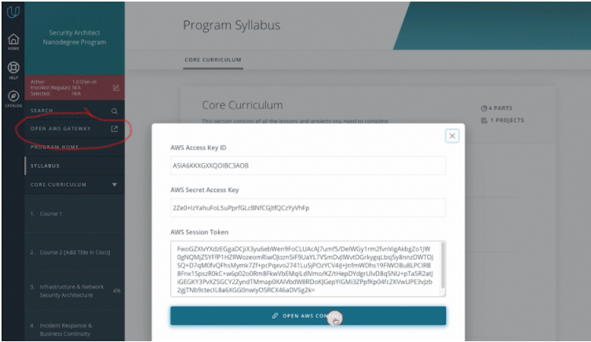

Step 2: Create a notebook instance

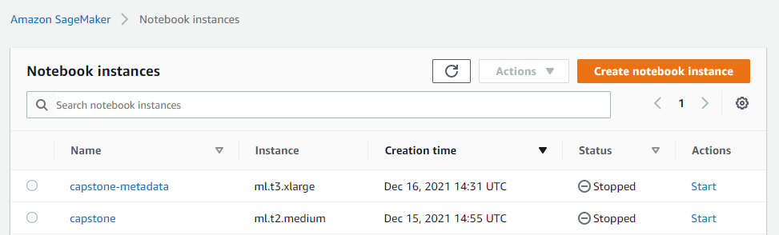

Step 3: Download the starter files from https://github.com/udacity/nd009t-capstone-starter

Step 4: Upload the starter files to my workspace

## Explanation of files used in project

a) sagemaker.ipynb - jupyter notebook used for this project

b) train.py - script for training the model and hyperparameter tuning

c) debug.py - script for debugging and profiling

d) inference.py - script for creating PyTorchModel for deployment

e) file_list.json, file_list_test.json, file_list_val.json - list of image paths used to download images for training, testing and validation respectively

## Dataset

### Overview

I will be using the Amazon Bin Image Dataset (https://registry.opendata.aws/amazon-bin-imagery/) which contains images and metadata from bins of a pod in an operating Amazon Fulfillment Center. The bin images in this dataset are captured as robot units carry pods as part of normal Amazon Fulfillment Center operations.

The dataset contains 500,000 images of bins containing one or more objects. For each image there is a metadata file containing information about the image like the number of objects, it's dimension and the type of object. For this task, I will try to classify the number of objects in each bin.

The histogram below shows the distribution of quantity in a bin.  More than 90% of the bin images contain less than 10 items.  In this project, I will restrict my dataset to images with 5 or less items.  

 
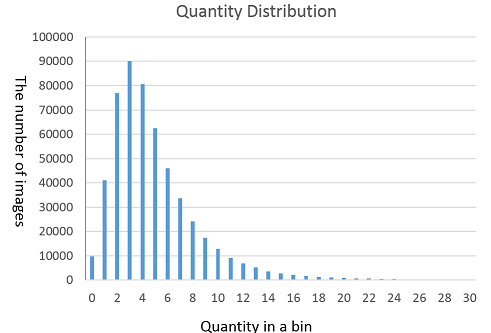

### Data Access

As part of the starter files, "file_list.json" contains a dictionary with class labels as keys and image paths as values. A function was written to create a subfolder for each key and download the images from the paths.  Each of these subfolder contain images where the number of objects is equal to the name of the folder. For instance, all images in folder `1` has images with 1 object in them. I notice that "file_list.json" only contains images with up to 5 items.

In the [Amazon Bin Image Dataset](https://registry.opendata.aws/amazon-bin-imagery/) documentation, there is a [link](https://github.com/silverbottlep/abid_challenge) on usage examples.  The metadata of all the images have been added into a [file](http://www.cs.unc.edu/~eunbyung/abidc/metadata.json).  I used this file to generate my validation and testing dataset

### Dataset used for Training, Validation and Testing

To avoid exceeding the course budget, I will only use a subset of images for training and validation purposes.  

	Number of images in training dataset: 10441 

	Number of images in validation dataset: 1015 

	Number of images in testing dataset: 1003 

Below is the distribution of my training, validation and testing datasets.

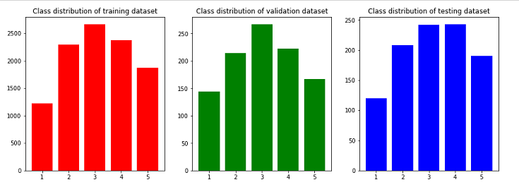

## Model Training

### Model Type

I fine tuned ResNet-18 model for this project.  ResNet models has been pre-trained on millions of images.  This helps them learn general features that can come in useful for a variety of datasets.

Since I am only training the fully connected layer, training can be done quickly and easily. However, I am using the whole network when performing prediction, so I can get the improved accuracy of using a CNN.

### Hyperparameters

I have chosen to specify the **batch size** and **learning rate** hyperparameters. 

These 2 factors affect the gradient descent of my model.  Increasing the learning rate speeds up the learning of my model, yet risks overshooting its minimum loss.  Smaller batch size takes up less computational memory but adds more noise to convergence.

### Model Performance

The model accuracy after 10 epochs is 29%.   This can be further improved by using a bigger training dataset and running more epochs.

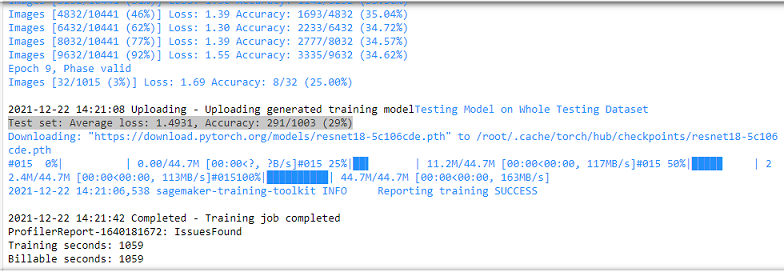

## Machine Learning Pipeline

Below are the steps of my project.

Step 1: Data is split for training and testing.

Step 2: Training data is passed into a pretrained model while testing data is used for evaluation.

Step 3: During each epoch, my model is trained and evaluated.  The weights of the fully connected layer are then updated and used for the next epoch.

Step 4: The final model is deployed to an endpoint.

Step 5: Production data is passed to the endpoint for inference.

The workflow below depicts my project pipeline.

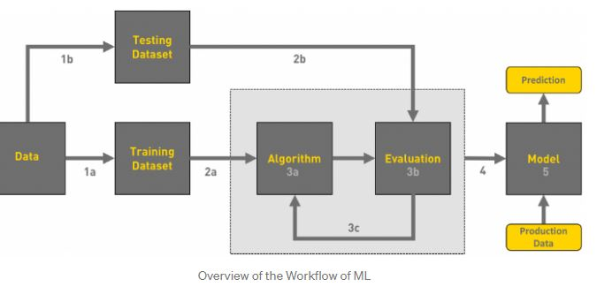

## Standout Suggestions:

## Hyperparameter Tuning

I executed hyperparameter tuning for batch size and learning rate.  Batch size is a categorical parameter with values 32, 64, 128 and 256.  Learning rate is a continuous parameter between 0.001 and 0.1.

I specified a maximum of 4 training jobs.  The objective is to minimize the Cross Entropy Loss.
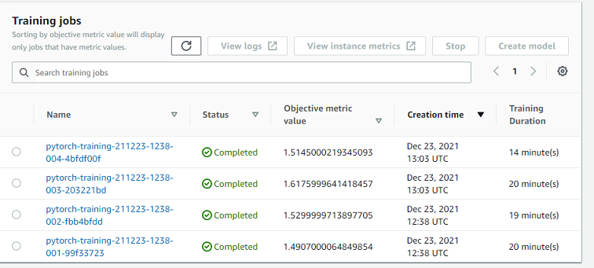

The best batch size is 32 and best learning rate is 0.040564834458224286.

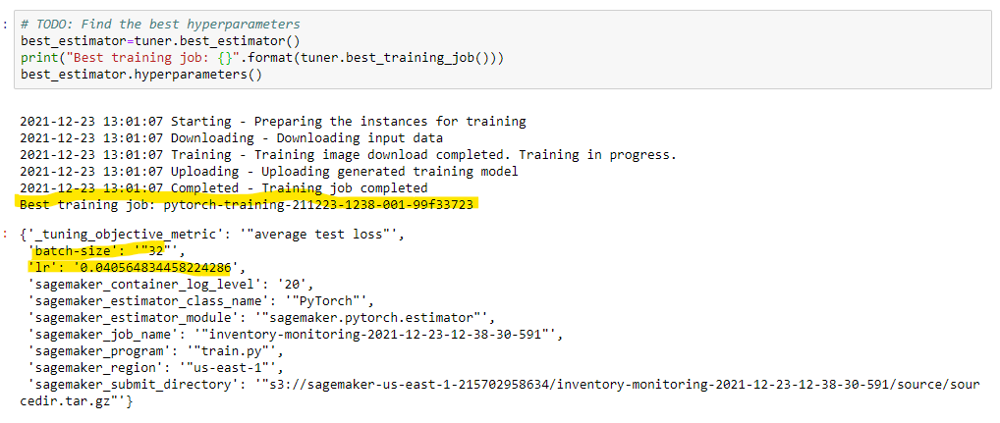

## Debugging and Profiling

I set up debugging and profiling rules to monitor and debug my model.  After plotting the debugging output, I notice that the Cross Entropy Loss for training does not decrease after 2000 steps.  Validation loss fluctuates and does not decrease with increasing epochs.

This is probably due to overfitting since I only used 10,441 images for training .  I should use a larger dataset for training to reduce overfitting.

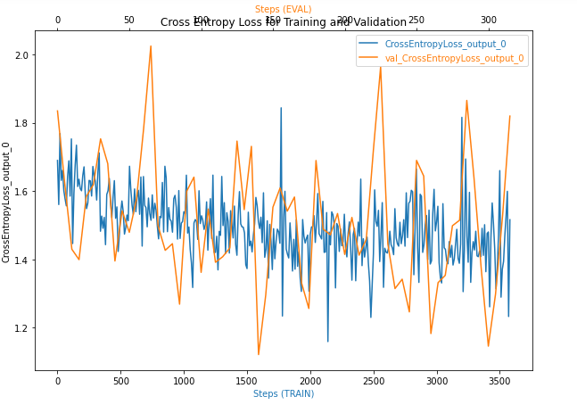

The profiling report is attached as "profiler-report.html"

## Deployment

Using the tuned model, I created a PyTorchModel from my saved model and wrote inference.py script to serialize and transform the input image. I deployed it to an endpoint as shown below.

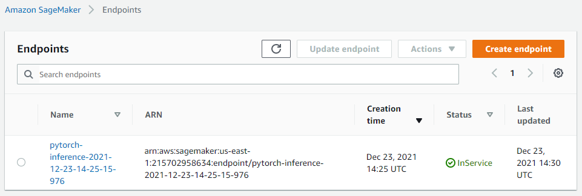

Code reference:
https://sagemaker.readthedocs.io/en/stable/frameworks/pytorch/using_pytorch.html#load-a-model
https://docs.aws.amazon.com/sagemaker/latest/dg/adapt-inference-container.html

### Querying endpoint

A JPEG image is sent to the predictor.predict() function.  The response is a numpy array with 5 values.  The position of the largest value correspond to the predicted label.  For example, first value is the prediction for 1 item.

Code to query endpoint:
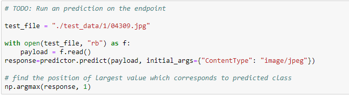

## Multi-instance Training

By specifing the instance count to be greater than 1, the training job will run on multiple instances.  This will help to speed up the training job.

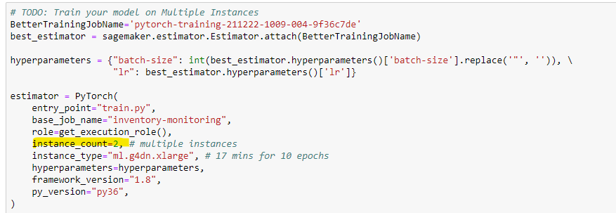
